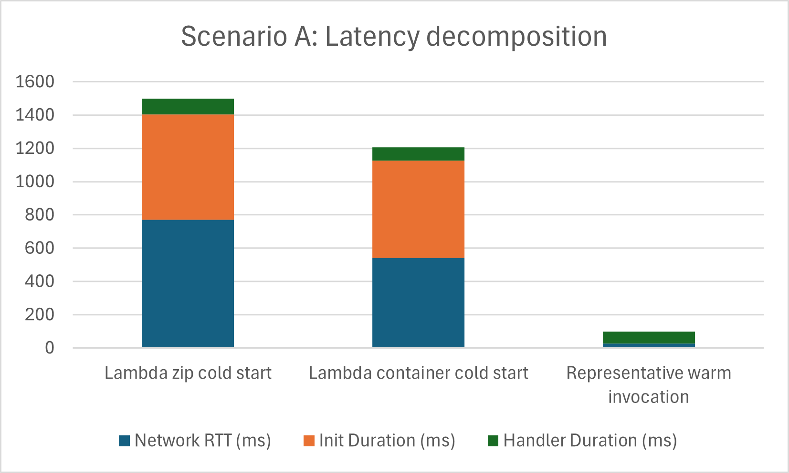

# Assignment 1: Deploy All Environments

### results are in the file assignment-1-endpoints.txt

To verify the deployment, I invoked each endpoint using the same input query and compared the returned results arrays. In every case, the request completed successfully and returned HTTP status 200. Most importantly, all four environments produced exactly the same top-5 nearest neighbors, with identical indices and distances:

- 35859 / 12.001459
- 24682 / 12.059946
- 35397 / 12.487080
- 20160 / 12.489519
- 30454 / 12.499402

# Assignment 2: Scenario A — Cold Start Characterization

Both Lambda functions were left idle for at least 20 minutes and then tested with 30 sequential requests sent at a rate of 1 request per second. In both runs, one cold-start request was observed and the remaining requests were warm.

For the Lambda zip deployment, the cold-start request reached 1499.9 ms client-side latency. CloudWatch showed about 634.2 ms of `Init Duration` and 95.7 ms of handler duration. For the Lambda container deployment, the cold-start request reached 1207.9 ms client-side latency, with about 582.5 ms of `Init Duration` and 82.2 ms of handler duration.

Warm requests were much faster in both variants. A representative warm invocation had about 99.0 ms total client-side latency and about 72.0 ms of handler duration.

Using the required decomposition, the estimated latency components were:

| Case                           | Total latency (ms) | Init Duration (ms) | Handler Duration (ms) | Estimated Network RTT (ms) |
| ------------------------------ | -----------------: | -----------------: | --------------------: | -------------------------: |
| Lambda zip cold start          |             1499.9 |              634.2 |                  95.7 |                      770.0 |
| Lambda container cold start    |             1207.9 |              582.5 |                  82.2 |                      543.2 |
| Representative warm invocation |               99.0 |                0.0 |                  72.0 |                       27.0 |

In this experiment, the container deployment had a slightly lower cold-start latency than the zip deployment. However, both variants showed the same overall pattern: warm requests were fast, while cold starts added a large extra initialization delay.
This difference is mainly related to initialization overhead and network overhead visible in end-to-end latency.

**Figure 1.** Latency decomposition for Lambda zip cold start, Lambda container cold start, and a representative warm invocation.

In this experiment, the container deployment had a slightly lower cold-start latency than the zip deployment. However, in both variants the main difference between warm and cold behavior was the additional initialization delay.

# Assignment 3: Scenario B — Warm Steady-State Throughput

All endpoints were warmed up before the measurements. Then 500 requests were sent to each target at the required concurrency levels: `c=5` and `c=10` for both Lambda variants, and `c=10` and `c=50` for Fargate and EC2. The table below summarizes the measured client-side latency results.

| Environment        | Concurrency | p50 (ms) | p95 (ms) | p99 (ms) | Server avg (ms) |
| ------------------ | ----------: | -------: | -------: | -------: | --------------: |
| Lambda (zip)       |           5 |  94.1150 | 116.8190 | 147.4704 |            77.4 |
| Lambda (zip)       |          10 |  77.1449 | 113.4859 | 143.3341 |            77.4 |
| Lambda (container) |           5 |  94.8149 | 114.9111 | 139.0493 |            77.0 |
| Lambda (container) |          10 |  92.6563 | 113.9554 | 150.2216 |            77.0 |
| Fargate            |          10 |    794.3 |   1005.9 |   1099.8 |               — |
| Fargate            |          50 |   3918.1 |   4195.8 |   4295.9 |               — |
| EC2                |          10 | 178.5603 | 243.4694 | 280.2406 |               — |
| EC2                |          50 |    915.4 |   1084.7 |   1189.9 |               — |

For Lambda, the server-side average was estimated from warm `Duration` values in CloudWatch `REPORT` lines, excluding invocations with `Init Duration`. For Fargate and EC2, the required `query_time_ms` values were not available in the uploaded files.

No case satisfied the instability condition `p99 > 2 × p95`. The Lambda results remained relatively stable between `c=5` and `c=10`, which is consistent with Lambda’s scaling model, where concurrent requests are served by separate execution environments. In contrast, Fargate and EC2 showed much higher latency at `c=50` than at `c=10`, which indicates queuing and resource contention on a single running task or instance.

The difference between server-side `query_time_ms` and client-side latency is caused by additional overhead outside the application itself, such as network transfer, connection handling, and request/response processing.

# Assignment 4: Scenario C — Burst from Zero

To simulate a burst after inactivity, Lambda was left idle for at least 20 minutes and then 200 requests were sent simultaneously to all four targets. Lambda was tested at concurrency 10, while Fargate and EC2 were tested at concurrency 50.

| Target Environment | p50 (ms) | p95 (ms) | p99 (ms) | Max Latency (ms) | Cold Starts |
| ------------------ | -------: | -------: | -------: | ---------------: | ----------: |
| Lambda (zip)       |     95.6 |    647.3 |   1153.5 |           1202.3 |          10 |
| Lambda (container) |     98.5 |    467.2 |   1530.7 |           1579.3 |          10 |
| EC2 (c=50)         |    857.9 |   1078.2 |   1112.7 |           1117.1 |           0 |
| Fargate (c=50)     |   3876.8 |   4202.3 |   4304.5 |           4310.4 |           0 |

Lambda’s burst p99 was much higher than its p50 because the burst arrived after the execution environments had been reclaimed. As a result, all 10 Lambda execution environments had to cold start again, which added a large initialization delay to part of the requests.

A bimodal latency pattern is visible for Lambda: one group of requests remained near the warm latency level (around 96–99 ms p50), while another group was much slower because of cold starts, which pushed p95 and p99 far upward. This is consistent with the observed 10 cold starts for both Lambda variants.

Neither Lambda variant met the `p99 < 500 ms` SLO under burst conditions. EC2 and Fargate also did not meet the SLO in this configuration.

# Assignment 5: Cost at Zero Load

Current AWS pricing for `us-east-1` was checked for Lambda, Fargate, and EC2. Lambda is billed per request and per execution duration, so at zero load its idle cost is zero. Fargate and EC2, in contrast, generate cost as long as the task or instance remains running.

For the tested Fargate configuration (`0.5 vCPU`, `1 GB`), the hourly idle cost is:

`0.5 × 0.04048 + 1 × 0.004445 = 0.024685 USD/hour`

For EC2, the tested instance type was `t3.small`, priced at `0.0208 USD/hour`.

| Environment              | Hourly idle cost (USD) | Monthly cost at 24 h/day (USD) | Idle cost for 18 h/day (USD/month) |
| ------------------------ | ---------------------: | -----------------------------: | ---------------------------------: |
| Lambda                   |               0.000000 |                         0.0000 |                             0.0000 |
| Fargate (0.5 vCPU, 1 GB) |               0.024685 |                        17.7732 |                            13.3299 |
| EC2 (t3.small)           |               0.020800 |                        14.9760 |                            11.2320 |

Lambda has zero idle cost because no requests are processed when traffic is zero. Fargate and EC2 do not have zero idle cost, because their resources remain allocated and billed even when no requests are being served.

# Assignment 6: Cost Model, Break-Even, and Recommendation

The traffic model corresponds to **8.37 million requests per month**.
Using the Scenario B warm Lambda duration (`77.4 ms` for zip, `77.0 ms` for container) and `0.5 GB` memory, the estimated monthly costs are:

| Environment        | Monthly cost (USD) |
| ------------------ | -----------------: |
| Lambda (zip)       |              7.073 |
| Lambda (container) |              7.045 |
| EC2                |             14.976 |
| Fargate            |             17.773 |

The break-even point between Lambda and Fargate is about **8.1 average RPS**. Below this level, Lambda is cheaper; above it, Fargate becomes more cost-competitive.

For the cost vs. RPS chart, Lambda should be shown as a **linear** cost curve, while EC2 and Fargate should be shown as **flat** monthly-cost lines. The Lambda–Fargate intersection should be marked at about **8.1 RPS**.

**Recommendation.**  
Under this traffic model, Lambda is the cheapest option. However, as deployed it does **not** meet the `p99 < 500 ms` SLO under burst traffic: in Scenario C, Lambda zip reached `1153.5 ms` p99 and Lambda container reached `1530.7 ms` p99. EC2 also failed the SLO (`1112.7 ms` p99), and Fargate performed worst (`4304.5 ms` p99).

I recommend **Lambda with provisioned concurrency**. In Scenario B, Lambda had the best warm latency, while in Scenario C its high tail latency was caused mainly by cold starts. Provisioned concurrency would remove this cold-start penalty and make Lambda more suitable for bursty traffic.

This recommendation would change if the average load increased above about **8.1 RPS**, because Lambda would then become more expensive than Fargate.
